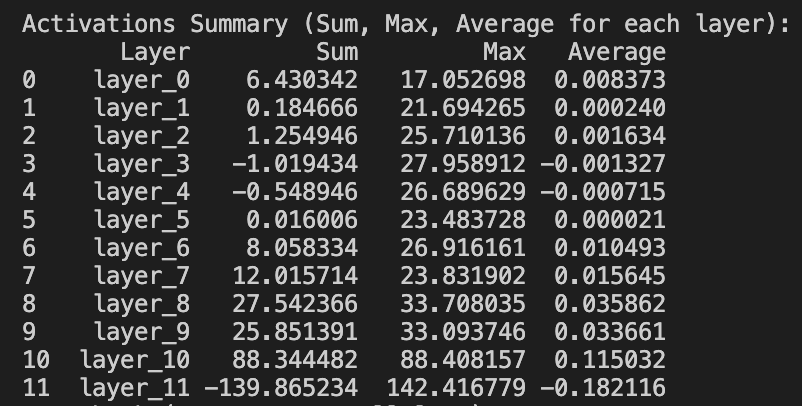
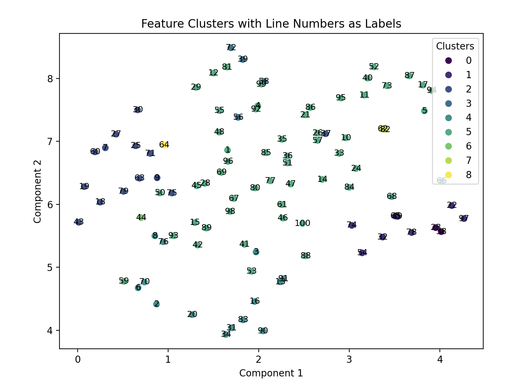
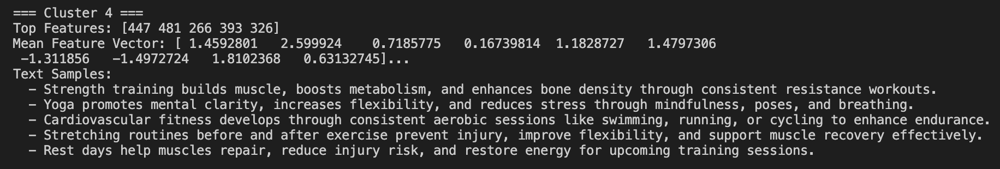

# MCDA5511 Assignment #4: Brain Surgery - Analysis of LLM through Sparse AutoEncoder

## Submitted By
- Louise Fear - A00410480
- Sudeep Raj Badal - A00431008
- Mohammed Abdul Thoufiq - A00487041
- Sukanta Dey Amit - A00483108

## 1. Finding out the layer for insertion of Hooks

For identifying the best layer to insert hooks, we initially implemented the wrapper class by inserting hooks at each of the 12 layers of the model. The goal was to examine the activations at each layer and analyze which one captured the most interesting and abstract features. By observing the activation values at each layer, we aimed to determine the most informative layer for our task.

The table below shows the activation statistics for each layer.
- Sum: total activation across all tokens and features
- Max: High activation value in the layer.
- Average: Average activation value in the layer.

From the results, layer 10 had the highest sum and max activations, followed by layer 8 and layer 9. Layer 6, however, was chosen for hook placement. This aligns with suggestions from the Scaling Monosemanticity paper, where placing hooks in middle layers captures more abstract relationships while maintaining efficiency. Given the smaller model size and limited computing resources, layer 6 was selected to strike a balance between complexity and computational cost.

While layers 7 and 8 showed relatively stable activation patterns and could have yielded interesting results, we opted for layer 6 to avoid the potential overhead of higher layers that capture more complex relationships, which may not be as interpretable for this analysis. With more time and computational resources, exploring layers 7 and 8 would be a worthwhile next step.

Our chosen layer 6 also aligns well when put together with the idea from the `Scaling Monosemanticity paper` that placing the hooks at the middle layer firstly makes the autoencoder training and inference cheaper since the residual stream is smaller than MLP layer and focusing on the residual stream prevents cross-layer superposition. 

Cross-layer superposition is the idea that gradient descent isn't affected by the specific layer that it is implemented in so the features would be spread across the layers. Even though there is not a concrete solution for it available yet, focusing on the residual stream - which is sum of outputs of all previous layers - will add the activations of features represented in cross-layer superposition. Thigh might not fully solve the issue but this might be able to bypass the issue a little bit

Source: https://transformer-circuits.pub/2024/scaling-monosemanticity/index.html#discussion-limitations

## Training Data Generation for Sparse Autoencoder

In this section, we built a class that generates training data for the sparse autoencoder. The autoencoder was trained on activations collected from a Language Model using a corpus of prompts which is iterated through to generate corresponding text and activation. It is stored in suitable format for autoencoder training. The specifications for the corpus of prompts are shows below. 

## Prompts Generation

For the training data, we selected a diverse set of **100 prompts** covering five key themes
- **Fitness & Health**
- **Technology & AI**
- **Society & Culture**
- **Environment & Sustainability**
- **Media & Entertainment**

These themes were chosen to ensure the prompts span a wide range of domains to test the broad basis for the model's activation analysis. These themes are common in natural language processing because of the commonality of the themes in real world documents available and use of language based on which LLM's are trained upon. These themes are also extremely rich in semantic content.

The list of prompts were generated by GPT4 

## Summary Statistics

- **Number of Prompts**: 100
- **Average Number of Words per Prompt**: 22 words
- **Total Number of Words Across Prompts**: 2,200 words
- **Themes Covered**: 5 
- **Most Frequent Words**: "health", "technology", "environment", "fitness", "culture"

## 4. Manual Feature Analysis
For this section, we manually analyzed the activations of the latent features from the sparse autoencoder. The goal was to identify the thematic significance of each latent feature by inspecting the text samples associated with the highest activations. Below is a summary of our findings, with a focus on the common themes identified from the samples. This manual process helps to interpret the features that were automatically learned by the model, linking them to specific topics.

**Latent Feature 0: Diverse Global Issues**
- Sample 1: “Access to clean water remains a global issue, especially in regions lacking infrastructure and facing resource scarcity.”
- Sample 2: “Film production uses digital effects and global collaboration, streamlining workflows and enabling complex cinematic visuals.”
- Sample 3: “Racial discrimination impacts employment, education, and housing opportunities, perpetuating systemic inequality and social injustice.”
- Sample 4: “Television news blends information and entertainment, shaping public discourse and influencing audience perceptions.”
- Sample 5: “Balanced diets include whole foods, healthy fats, and proteins to support energy levels and muscle maintenance.”

**Interpretation:** This feature captures global issues. The diversity of topics, such as environmental concerns, media influence, social justice, and health, suggests that Latent Feature 0 is general in nature and doesn’t focus on any one particular domain but instead represents a broad mix of societal and global topics.

**Latent Feature 1: Environmental and Health-Related Topics**
- Sample 1: “Water conservation strategies like rainwater harvesting and low-flow fixtures help address drought and freshwater scarcity.”
- Sample 2: “Rest days help muscles repair, reduce injury risk, and restore energy for upcoming training sessions.”
- Sample 3: “Civic engagement strengthens democracy when citizens vote, attend meetings, and advocate for policies that reflect public interests.”
- Sample 4: “Social media influencers shape trends in fashion, wellness, and lifestyle by sharing curated content with loyal followers.”
- Sample 5: “Renewable energy sources like wind and solar reduce greenhouse gas emissions and lessen dependence on fossil fuels.”

**Interpretation:** This feature predominantly represents environmental and health-related themes. Samples 1, 2, and 5 are directly related to health and wellness, focusing on issues like fitness recovery, diet, and sustainable energy. Sample 3 is related to civic engagement. The inclusion of social media influencers in Sample 4 links this feature to lifestyle and wellness trends.

**Latent Feature 2: Health and Wellness**
- Sample 1: “Income inequality creates economic divides, restricts upward mobility, and contributes to tension within and between social classes.”
- Sample 2: “Cloud computing offers scalable storage, remote access, and collaboration tools for businesses and individuals alike.”
- Sample 3: “Virtual reality enhances gaming and training by immersing users in simulated environments with realistic interactions.”
- Sample 4: “Urbanization transforms communities by increasing population density, housing demand, and infrastructure needs in growing cities.”
- Sample 5: “Human rights advocacy promotes dignity, equality, and justice through legal protections and international accountability mechanisms.”

**Interpretation:** This feature appears to have a more technology-related focus, but health themes are notably present in Sample 3 and Sample 5. These two samples address wellness and health topics, particularly in the context of virtual reality gaming (for mental and physical health) and advocacy for human rights.

**Latent Feature 3: Environment and Sustainability**
- Sample 1: “Hydration is essential for performance, recovery, and temperature regulation during and after physical activities.”
- Sample 2: “Rest days help muscles repair, reduce injury risk, and restore energy for upcoming training sessions.”
- Sample 3: “Electric vehicles offer a cleaner alternative to gas cars but face infrastructure and battery material sourcing challenges.”
- Sample 4: “Access to clean water remains a global issue, especially in regions lacking infrastructure and facing resource scarcity.”
- Sample 5: “Renewable energy sources like wind and solar reduce greenhouse gas emissions and lessen dependence on fossil fuels.”

**Interpretation:** This feature clearly focuses on environmental and health-related issues, with a strong emphasis on sustainability. Samples 3, 4, and 5 are related to renewable energy, electric vehicles, and water conservation, all topics that fall under environmental sustainability. Sample 1 and Sample 2, related to hydration and recovery, touch on health topics as well.

**Latent Feature 4: Technology and Innovation**
- Sample 1: “Smartphones enhance daily life with apps for communication, navigation, and entertainment across various tasks.”
- Sample 2: “Digital twins create virtual models of physical systems for monitoring, testing, and predictive maintenance applications.”
- Sample 3: “Quantum computing accelerates processing capabilities by using qubits for complex problem-solving beyond classical limitations.”
- Sample 4: “Video games create interactive experiences that engage users through graphics, storytelling, and multiplayer collaboration.”
- Sample 5: “Blockchain technology secures transactions, decentralizes data, and enables transparency across financial and logistic systems.”

**Interpretation:** This feature represents a strong focus on cutting-edge technologies such as smartphones, digital twins, quantum computing, blockchain, and video games. The consistent theme is technological innovation in a variety of fields, including communication, data management, and entertainment.

Through this manual analysis, we were able to interpret several latent features and their associated topics. For example:
- Latent Feature 1 seems to represent environmental and health-related topics.
- Latent Feature 2 touches on both technology and wellness.
- Latent Feature 3 is focused on sustainability and environmental topics.
- Latent Feature 4 is associated with technology and innovation.

By identifying these features and associating them with thematic content, we can better understand the latent features learned by the model, which will inform how we interpret and use the features in future applications.

## 5. Automated Feature Analysis

#### Cluster 0: Technology and AI
- Top Features: [447, 266, 288, 326, 481]
    - These features are highly associated with technology topics, particularly AI, deep learning, and automation. Feature 447 appears frequently, indicating a broad technological concept that might relate to multiple facets of AI. The other features like 266 and 288 likely represent more specific aspects of AI like image recognition or predictive modeling.
- Mean Feature Vector:
    - The mean activation values are positive, suggesting that the features in this cluster strongly activate in response to topics related to technology. Higher values indicate a stronger connection to AI, machine learning, and automation. The mean vector helps us understand the dominant themes in this cluster, with higher activations meaning that these topics are more strongly represented.
- Interpretation:
    - This cluster is primarily about technology and AI. The mean feature values suggest a dominant focus on AI-driven technologies, with deep learning and predictive systems being strong drivers. Feature 447 likely represents a broad tech-related theme, but the other features in the top list suggest narrower aspects of technology.

#### Cluster 4: Health and Wellness

- Top Features: [447, 481, 266, 393, 326]
    - This cluster is focused on health and wellness, including topics like fitness, nutrition, and exercise. Features like 481 (likely related to fitness), 266 (which may refer to nutrition), and 326 (likely linked to recovery and wellness) point to specific health-related topics.
- Mean Feature Vector:
    - The mean values here are strong across most features, indicating a strong activation in response to health-related themes. The strong activations of features like 481 and 266 suggest that the model associates these features with core wellness concepts, such as exercise routines and diet. High activations in this cluster mean a clear connection to wellness and health topics.
- Interpretation:
    - Cluster 4 shows clear connections to fitness and wellness. The high activations in features like 481 suggest that this cluster is strongly tied to exercise and nutrition, while Feature 447 still appears, likely as a broad technology-related feature.

#### Cluster 5: Health and Wellness
- Top Features: [447, 481, 393, 266, 640]
    - This cluster is focused on health and wellness, including topics like fitness, nutrition, and exercise. Features like 481 (likely related to fitness), 266 (which may refer to nutrition), and 326 (likely linked to recovery and wellness) point to specific health-related topics.
- Mean Feature Vector:
    - The mean values here are strong across most features, indicating a strong activation in response to health-related themes. The strong activations of features like 481 and 266 suggest that the model associates these features with core wellness concepts, such as exercise routines and diet. High activations in this cluster mean a clear connection to wellness and health topics.
- Interpretation:
    - Cluster 5 shows clear connections to fitness and wellness. The high activations in features like 481 suggest that this cluster is strongly tied to exercise and nutrition, while Feature 447 still appears, likely as a broad technology-related feature.

### Insights and Next Steps
- Repetition of Feature 447:
    - Feature 447 consistently appears across all three clusters, suggesting that it represents a broad concept that spans multiple domains—technology, environment, and health. This could indicate a unifying concept that influences various topics in the model’s interpretation. However, it’s important to note that it might not be the most informative feature for these clusters; the other features in the top list might hold more specific relevance to the clusters.
- Mean Values and Activation Strength:
    - The mean activation values indicate how strongly a cluster is associated with certain topics. Higher mean values suggest stronger activations, correlating with a more pronounced presence of those topics in the cluster. For instance, Cluster 4 (Health) has strong mean values for features like 481, indicating that health-related topics are a dominant theme in this cluster.
- Future Exploration (Clamping):
    - We could explore these clusters further by clamping the activations of certain features (setting their activation values to high or low) to see how it influences the output. This would allow us to focus on the most influential features for each cluster and explore how specific features drive the generation of related topics. For instance, clamping the health-related features in Cluster 4 could help us better understand how fitness topics influence the model’s output and whether they can generate more health-related content.

